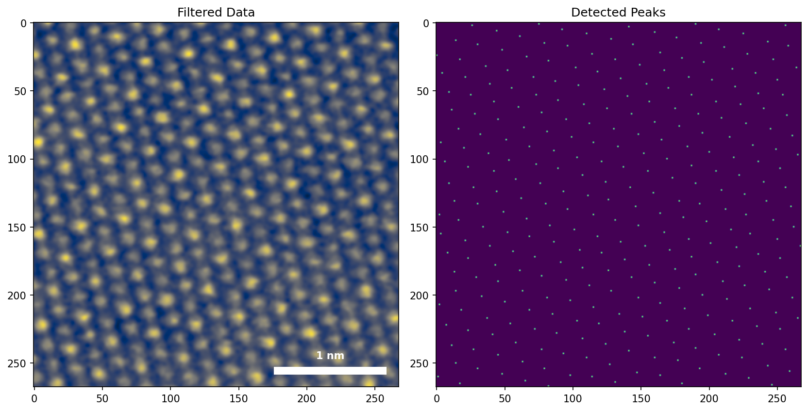

# phd_research

Repo for old Jupyter notebooks, data analysis and visualizations from physics PhD research. 

### Prerequisites

- Python 3.10
- [Poetry](https://python-poetry.org/) for dependency management

# Project Notebooks

## hBNonSiSEMTrajectories

  

- Visualization of SEM electron trajectories inside a typical semiconducting multilayer sample.

## HRSTEMAtoms

  

- Analysis of an atomic resolution HRSTEM image. Identifying all atomic columns and fitting 2D Gaussian curves to each to extract properties of the material.

## NanoparticleSizeDistribution

  

- Using thresholding and region analysis on STEM images of nanoparticle films to get statistical properties of synthesis runs.

## AverageUnitCellNanotube

  

- Using template matching to extract unit cells of 1D crystallite chains inside of nanotubes in HRSTEM images and creating an average composite super resolution image and figure.

## datCasinoToh5
- Parsing utility to convert `.dat` files to `.h5`. Data generated using CASINO software simulating electrons in a SEM incident on a multilayer substrate.

