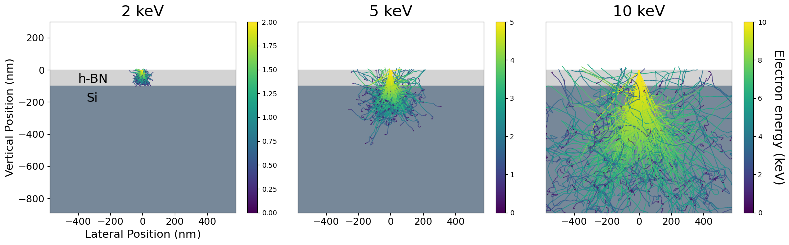
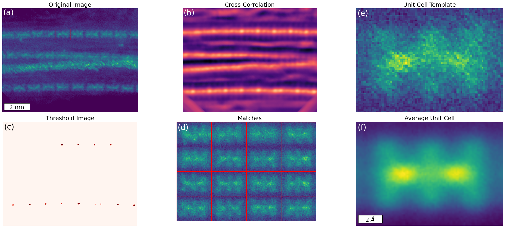
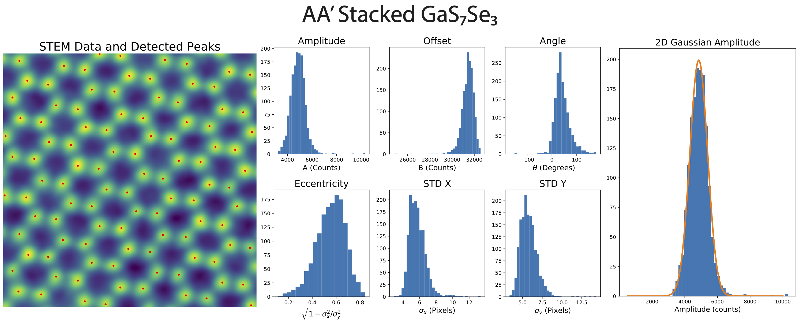

# phd_research

Repo for old Jupyter notebooks, data analysis and visualizations from physics PhD research. 

### Prerequisites

- Python 3.10
- [Poetry](https://python-poetry.org/) for dependency management

# Project Notebooks

## [NanoparticleSizeDistribution](notebooks/NanoparticleSizeDistribution.ipynb)

  

- Using thresholding and region analysis on STEM images of nanoparticle films to get statistical properties of synthesis runs.

## [hBNonSiSEMTrajectories](notebooks/hBNonSiSEMTrajectories.ipynb)

  

- Visualization of SEM electron trajectories inside a typical semiconducting multilayer sample.

## [AverageUnitCellNanotube](notebooks/AverageUnitCellNanotube.ipynb)

  

- Using template matching to extract unit cells of 1D crystallite chains inside of nanotubes in HRSTEM images and creating an average composite super resolution image and figure.

## [HRSTEMAtoms](notebooks/HRSTEMAtoms.ipynb)

  

- Analysis of an atomic resolution HRSTEM image. Identifying all atomic columns and fitting 2D Gaussian curves to each to extract properties of the material.

## [datCasinoToh5](notebooks/datCasinoToh5.ipynb)
- Parsing utility to convert `.dat` files to `.h5`. Data generated using CASINO software simulating electrons in a SEM incident on a multilayer substrate.

